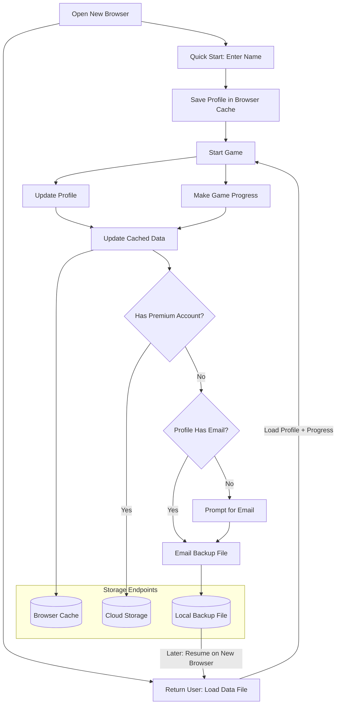

# Browser-Based Game System

A lightweight game system designed for progressive user engagement. Players can start immediately with minimal commitment and choose their preferred way to preserve progress later.  [Connecting to people](docs/connecting-to-people.md) will be just as easy.

Basically, free plan gets browser storage of game data and friends data, Premium memberships add cloud storage.

## Features

### Quick Start
- Begin playing instantly by just entering a name
- Automatic progress saving in browser cache
- No initial account creation or email required

### Storage Options

#### Free Tier
- Automatic browser cache storage
- Email-based backup system
  - Request a backup file anytime
  - Easy restore on any browser
  - No account needed

#### Premium Tier
- Real-time cloud synchronization
- Seamless multi-browser experience
- Automatic backup and restore

## System Flow

The diagram below shows how users progress from quick start to managed storage:

## How It Works

1. **New Players**
   - Enter name and start playing
   - Progress automatically saved to browser cache
   - No registration required

2. **Saving Progress**
   - All gameplay automatically saved to browser cache
   - Choose backup method when ready:
     - Free: Request backup file via email
     - Premium: Enable cloud synchronization

3. **Resuming on New Browser**
   - Free users: Upload backup file
   - Premium users: Automatic sync
   - Instant access to all previous progress

## Design Philosophy

The system is built around progressive engagement:
- Zero friction to start playing
- Automatic local saving
- Optional backup methods
- Choice between simplicity (email backup) and convenience (cloud sync)

## Development Status

This project is under active development. Check our [Development Plan](docs/development-plan.md) for details on:
- Current progress
- Upcoming features
- Testing strategy
- Release timeline

## Getting Started

[Coming soon]